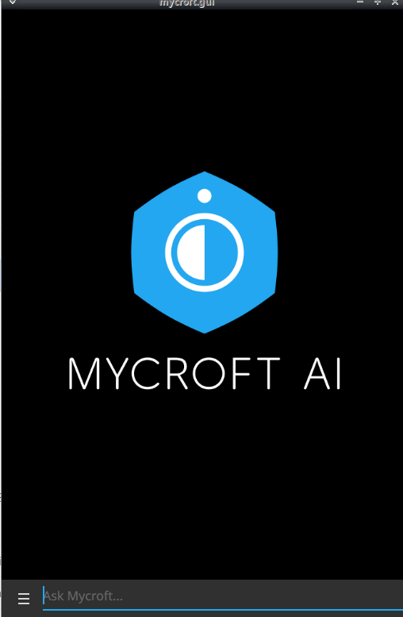

#  Email Commands Skill

Control Mycroft by email

## About 

Allows you to send commands to mycroft by email, inspired by [this blog post](https://medium.com/@thesanjeetc/want-to-control-something-with-siri-heres-how-bae98aceb586)
 
 
 
 
# Skill configuration

I did not use mycroft home backend for skill settings, it is irresponsible 
to get your email credentials in there. Instead you need to edit mycroft.conf

This is a security measure, i will not change this behaviour

Add the following section to your [mycroft.conf](https://mycroft-ai.gitbook.io/docs/using-mycroft-ai/customizations/mycroft-conf)
```json

"email": {
   "mail": "",
   "password": "",
   "address":"imap.gmail.com", 
   "port":993,
   "folder":"inbox", 
   "time_between_checks":30, 
   "include_read": false,
   "whitelist": ["thisemail@isallowed.com", "email@thatcansend.commands"]
}
```

only mail, password and whitelist are required, other parameters use the 
defaults for gmail, if using a different provider you might need to change address and port

time_between_checks is in seconds, it is the time to sleep between checking 
for new emails, the "lag" between a command and its execution

whitelist is a list of emails allowed to send commands to mycroft, if the 
sender is not in this list then the emails will be ignored

some uses cases, like using siri Notes, will mark emails as read, setting
"include_read" to true will process those emails, note that this will 
execute ALL old emails on first run, it is strongly recommended that you 
only set this flag if using a newly created folder

# Email configuration

You might need to change some settings in your email provider, for gmail you need to
 
- enable less secure apps https://myaccount.google.com/lesssecureapps
- enable imap  https://mail.google.com/mail/u/1/?tab=mm#settings/fwdandpop


## Credits 
- JarbasAl

## Category
**Configuration**

## Tags
#configuration


